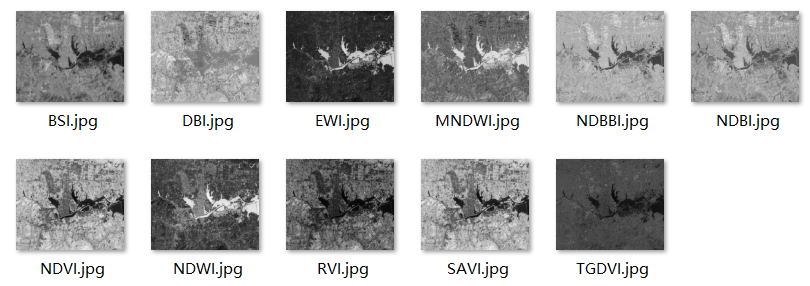

# RSImage-Feature-Index
### `【武大遥感】遥感原理与方法实习 | 基于特征指数的遥感专题信息提取`
 [FeatureIndex.cpp](./FeatureIndex.cpp) **核心代码**
 [TM影像](./TM影像) **多波段影像**
 [特征指数的专题信息图](./特征指数的专题信息图) **提取结果**

## TM影像  
#### `TM指美国陆地卫星4～5号专题制图仪（thematic mapper）所获取的多波段扫描影像。分为7个波段。主要特点为具较高空间分辨率、波谱分辨率、极为丰富的信息量和较高定位精度。`   
> TM - 1为0.45～0.52微米，蓝光波段
    TM - 2为0.52～0.60微米，绿光波段；
    TM - 3为0.63～0.69微米，红光波段，以上3段为可见光波段；  
    TM - 4为0.76～0.90微米，为近红外波段；  
    TM - 5为1.55～1.75微米，近红外波段；  
    TM - 6为10.40～12.50微米，为热红外波段；  
    TM - 7为2.08～2.35微米，近-中红外波段。
    
<!--  -->

## 特征指数
- 植被指数
    > RVI 比值植被指数   
    > NDVI 归一化植被指数  
    > SAVI 土壤调节植被指数   
    > TGDVI 三波段梯度差植被指数 
- 水体指数   
    > NDWI=(G-NIR)/(G+NIR)  
    > MNDWI=(G-SWIR)/(G+SWIR)  
    > EWI=(G-(NIR+MIR))/(G+(NIR+MIR))  
- 建筑用地指数  
    > DBI 差值建筑覆盖指数   
    > NDBI 归一化差值建筑用地指数  
    > NDBBI 归一化差值裸地与建筑用地指数  
    > BSI 裸土指数  

<!--  -->

## 阈值分割
- 迭代法 Literation
  >1. 计算图像的最大灰度值Ｚmax、最小灰度值Ｚmin，求平均得到初始阈值init_thres。
  >2. 根据阈值划分图像为目标和背景，并分别计算其灰度均值
  >3. 判断init_thres是否等于thres_tmp，若相等则退出循环，阈值为thres_tmp，否则，将thres_tmp赋给init_thres，转(2)继续执行迭代。
- 最大类间差法 Otus
  >1. 计算每个灰度值的概率并计算目标和背景的分布概率以及平均灰度值和方差。
  >2. 计算类间差
  >3. 取类间差最大的灰度值即为阈值

<!--  -->

